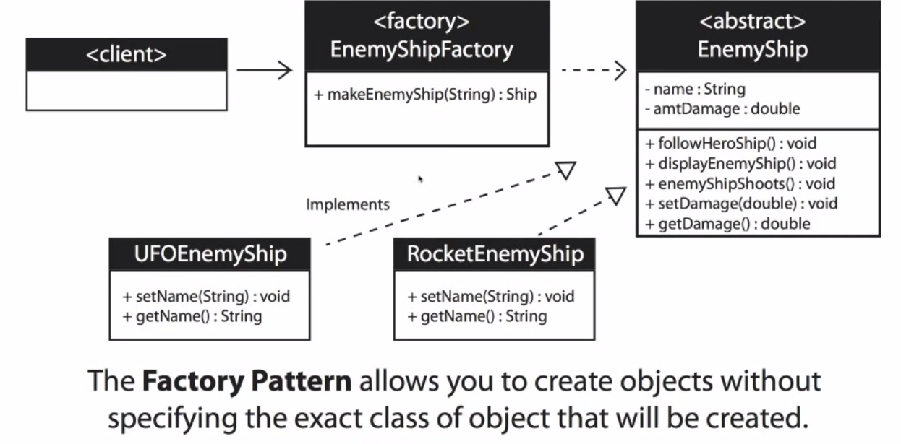

## Factory Design Pattern

**Entrance File**: EnemyTesting.java

**When to use it**:

- When you don't know ahead of time what class object you need
- When all the potential classes are in the same subclass hierachy
- When the class is chosen at run time

**Key Point**:

- Uses an *abstract* class to maintain all its optential subclass
- Creates a *factory* class to generate desired object dynamically

