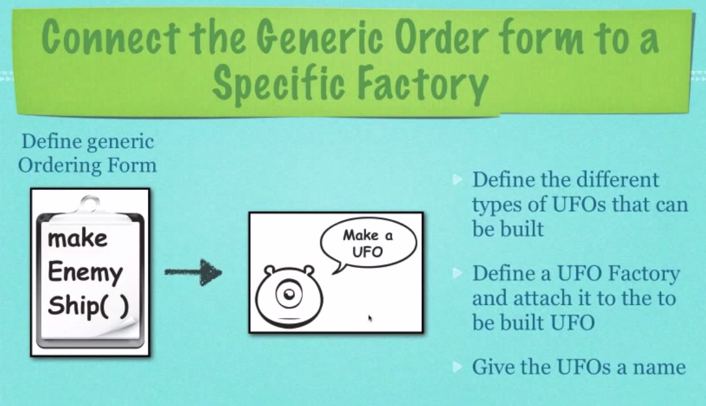
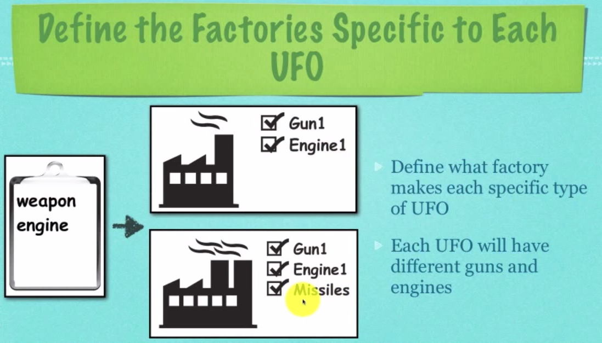
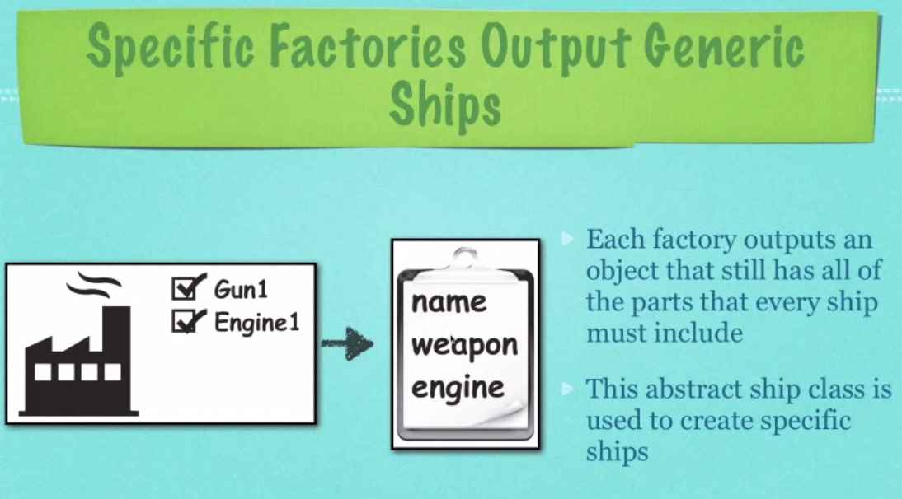
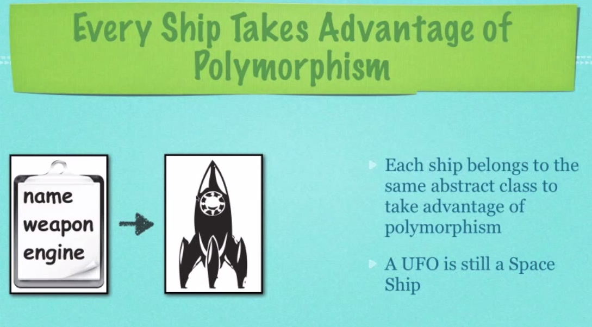
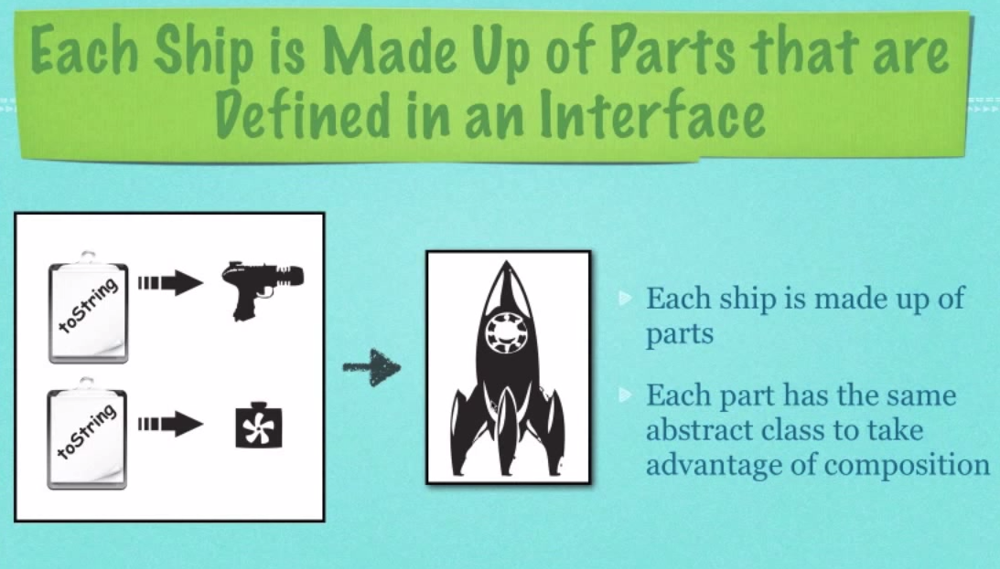

## Abstract Factory Design Pattern

**Entrance File**: EnemyTesting.java

**Tips**: 

To compile all java files - 

```shell
$ find . -name "*.java" | xargs javac

```

**What can we do with Abstract Factory**:

- Allows you to create families of related objects without specifying a concrete class
- Uses when you have many objects that can be added or changed dynamically during runtime

### Factory VS Abstract Factory

#### Factory BluePrint


#### Abstract Factory BluePrint


#### How Abstract Factory Works







