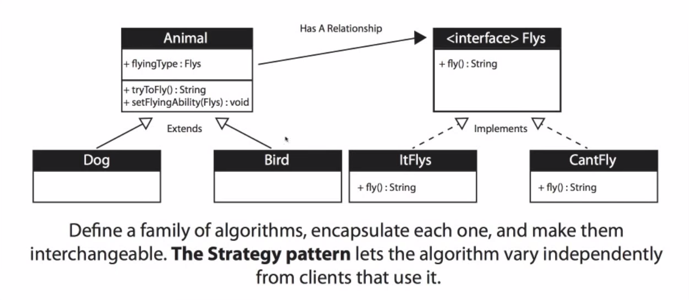

## Strategy Design Pattern

**Entrance File**: AnimalPlay.java

**Key Point**:

- Extracts *behavior* part as interface, in this case, *Fly* is one of flexible behaviors that we might reimplement in many classes
- Uses different classes to implement this interface, aiming to provide concrete impelementations for each kind of behavior
- Adds a trigger method to invoke the action in interface, for flexibility, we can also use setBehavior to change concrete action

