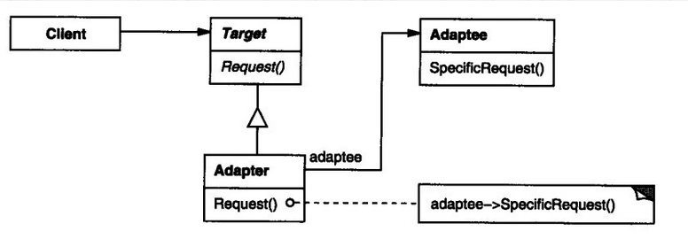
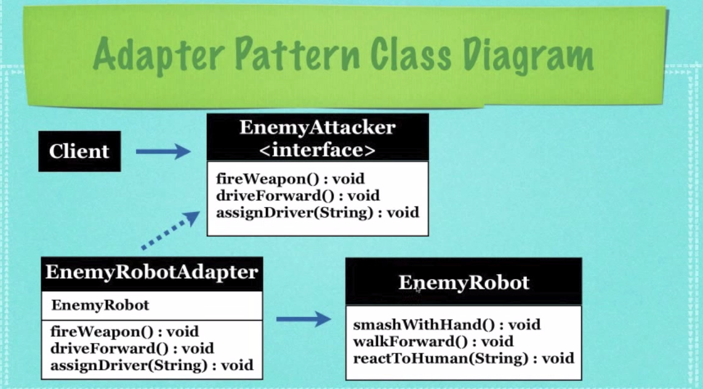

## Adapter Design Pattern

**Entrance File**: TestAttacker.java

**When to use it**:

- Allows 2 incompatible interfaces to work together

**Key Point**:

- Has a target interface
- Create an adapter to implement target interface, and pass the adaptee as the constructor parameter

