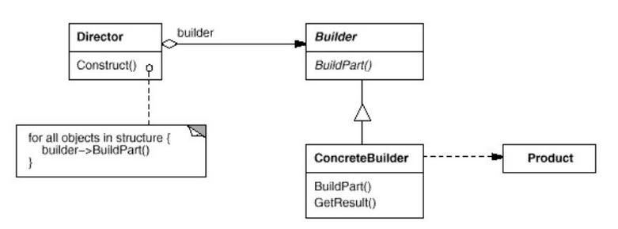

## Builder Design Pattern

**Entrance File**: TestBuilder.java

**What is Builder Pattern**:

Pattern used to create objects made from a bunch of other objects

**When to use it**:

- When you want to build an object made up from other objects
- When you want the creation of these parts to be independent of the main object

**UML**

**Key Point**:

- Creates an *abstract builder interface* and a *concrete builder class* to implement it
- Creates a driver class passing builder in the constructor and dirve builder to build object

