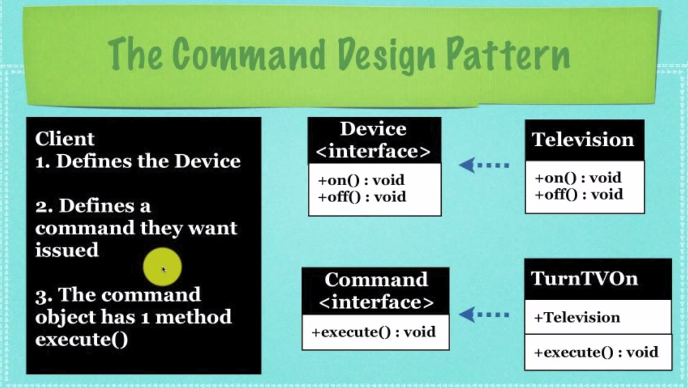

## Command Design Pattern

**Entrance File**: PlayWithRemote.java

**When to use it**:

- A lot of objects need to be operated by some commands, like turn on, turn off, volume up

**Key Point**:

- Create Command Interface and all the concrete commands extend it
- An object called the Invoker(like button) transfers this Command to another object called the Receiver(like TV) to execute the right code

